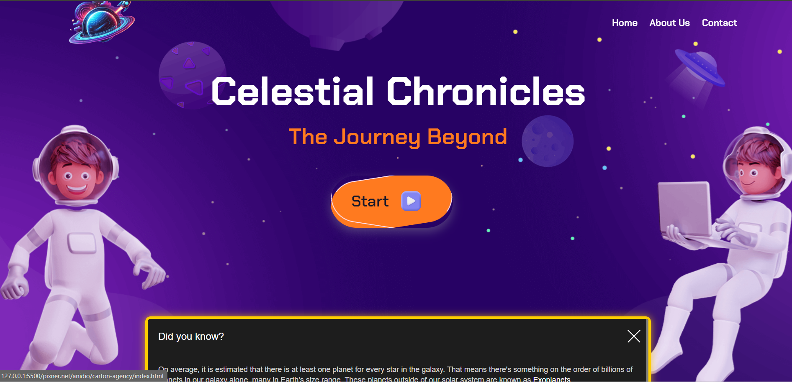
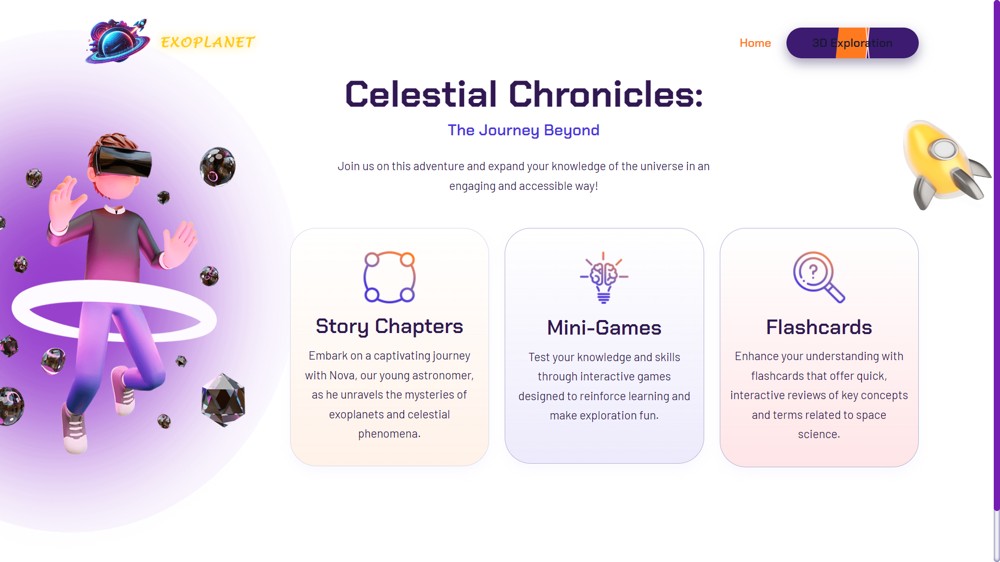
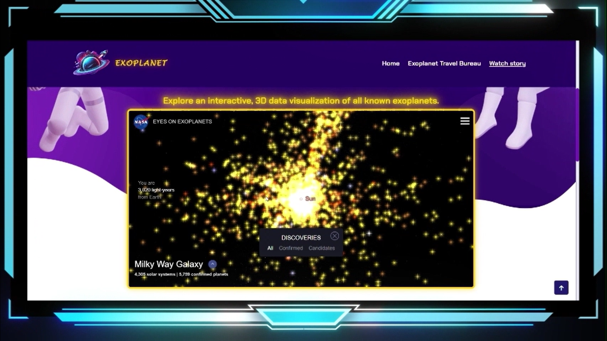
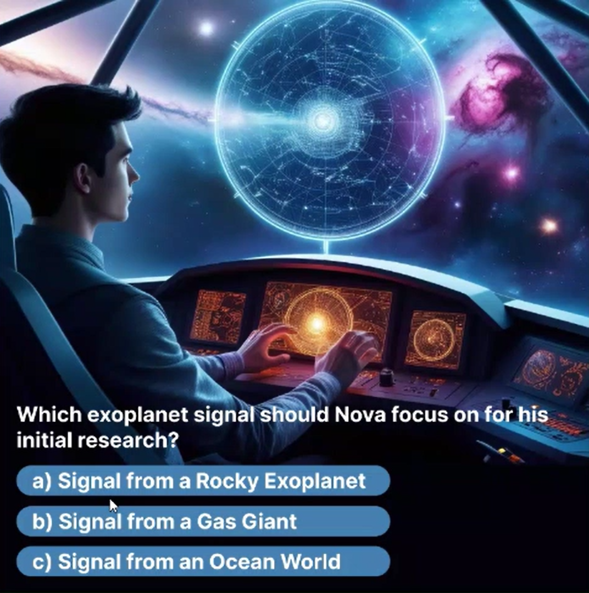
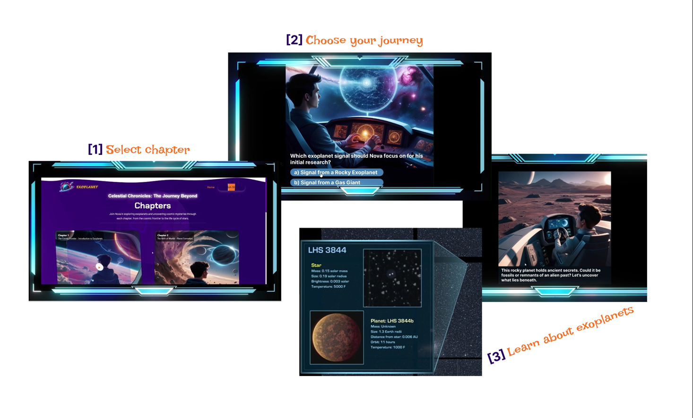
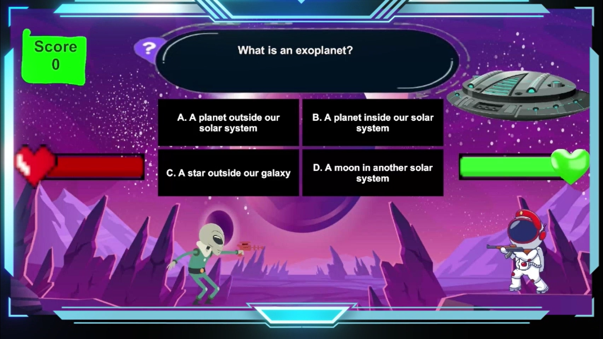

# 🌌 Celestial Chronicles
### NASA Space Apps Challenge Project

Welcome to **Celestial Chronicles**, an interactive space education platform developed for the **[NASA Space Apps Challenge](https://www.spaceappschallenge.org/about/)**.

The project combines storytelling, 3D galaxy exploration, educational content, and multiplayer mini-games to create an engaging way for users to learn about space, exoplanets, and astronomical concepts.

### 🌍 Website Screenshots




---

## 🚀 Project Overview

Celestial Chronicles is designed to make space education more interactive and enjoyable.

Users can explore a **3D galaxy environment**, follow educational story chapters, learn about topics such as **exoplanets and space science**, and test their knowledge through interactive challenges.

The project includes:

- 🌌 **3D Galaxy Exploration**  
  An immersive environment where users can explore celestial objects and learn more about space.



<br>

- 📖 **Interactive Story Chapters**  
  Educational chapters that introduce space concepts, including exoplanets and astronomical discoveries, through storytelling.
  
<p align="center">
  
  
</p>

<br>

- 🎮 **Multiplayer Shooting Mini-Game**  
  A competitive quiz-based shooting game where two players answer multiple-choice questions. The player who answers correctly and faster can shoot the opponent and earn points.



<br>

- 🃏 **Flash Cards**  
  A learning feature that helps users revise and reinforce important space-related information.

---

## 🛠️ Technologies Used

- ASP.NET
- SCSS
- JavaScript
- CSS
- HTML
- C#

---

# ⚙️ Installation & Setup

## Clone the Repository

Open PowerShell/Terminal:

```bash
git clone https://github.com/TayrinTunzina/Astronova-Dhk.git
```

---

# 🌐 Run the Website

### Requirements:
- Visual Studio Code
- Live Server Extension by Ritwick Dey

### Steps:

1. Open the project in VS Code.
2. Install the **Live Server** extension.
3. Navigate to:

```
Astronova-Dhk/website/pixner.net/anidio/carton-agency/
```

4. Select:

```
index.html
```

5. Click **Go Live** from the bottom-right corner of VS Code.

The website will open in your browser.

---

# 🎮 Run the Game

Make sure the repository is downloaded.

## Windows

Navigate to:

```
Astronova-Dhk/game/executable_for_windows/
```

Run:

```
AstroNova.exe
```

Press the Windows key to exit the game.

---

## Linux

Navigate to:

```
Astronova-Dhk/game/executable_for_linux/
```

Run:

```
executable.x86_64
```

Press the Windows key to exit the game.

---

## 🏆 NASA Space Apps Challenge

This project was created as part of the **NASA Space Apps Challenge 2024**, an international hackathon that encourages participants to develop innovative solutions using science, technology, and creativity.

---

## 👥 Team

Developed as part of the NASA Space Apps Challenge by Team AstroNova.

---

Copyright (c) 2026 Tayrin Tunzina

This project is licensed under the MIT License.
